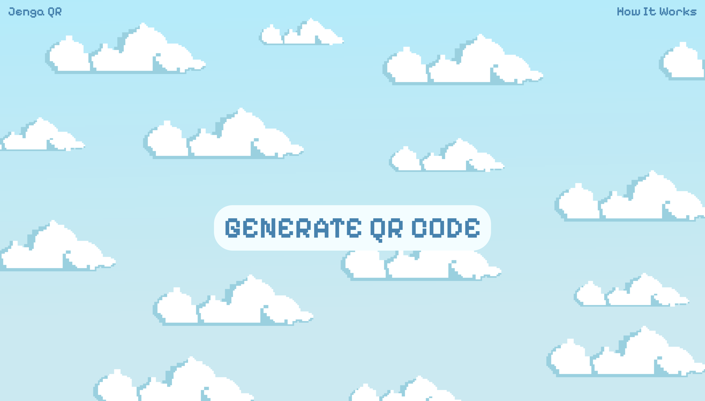

 <div id="top" align="center">

[![Contributors][contributors-shield]][contributors-url]
[![Forks][forks-shield]][forks-url]
[![Stargazers][stars-shield]][stars-url]
[![Issues][issues-shield]][issues-url]
[![LinkedIn][linkedin-shield]][linkedin-url]
</div>

<br />
<h3 align="center"> 🍎 Jenga QR 🍎 </h3>

  <p align="center">
    

    Generate QR codes on the go!

   ### What is a QR Code?

    A Quick Response code is a two-dimensional pictographic code used for its fast readability and comparatively large storage capacity.

    The code consists of black modules arranged in a square pattern on a white background. 

    The information encoded can be made up of any kind of data (e.g., binary, alphanumeric, or Kanji symbols)
    
  </p>
    <br />
    <a href="#"><strong>Explore the docs »</strong></a>
    <br />
    <br />
    <a href="https://github.com/SharleneNdinda/momo-cafe/issues">Report Bug</a>
    ·
    <a href="https://github.com/SharleneNdinda/momo-cafe/issues">Request Feature</a>
  </p>
</div>

<details>
  <summary>Table of Contents</summary>
  <ol>
    <li>
      <a href="#about-the-project">About The Project</a>
      <ul>
        <li><a href="#built-with">Built With</a></li>
      </ul>
    </li>
    <li>
      <a href="#getting-started">Getting Started</a>
      <ul>
        <li><a href="#prerequisites">Prerequisites</a></li>
        <li><a href="#installation">Installation</a></li>
      </ul>
    </li>
    <li><a href="#usage">Usage</a></li>
    <li><a href="#contributing">Contributing</a></li>
    <li><a href="#license">License</a></li>
    <li><a href="#contact">Contact</a></li>
    <li><a href="#acknowledgments">Acknowledgments</a></li>
  </ol>
</details>

##  About The Project

Jenga QR is a simple light-weight service. It is meant to deliver the following:

    ✅ Be able to generate unique QR codes based on a give url.

### 🚀 Getting Started

1. Clone this repository and setup virtual environment. Install all project requirements before proceeding.
```sh
  $ pip install -r requirements/base.txt
```

2. Setup your local `Postgres` database, update database configs and run migrations.
```sh
  $ python manage.py migrate
```

3. Run tests.
```sh
  $ pytest -v
```

4. Run development server.
```sh
  $ python manage.py runserver
```

5. Generate docs locally.
```sh
  $ cd docs/
  $ make html
  $ cd _build/html/
```

[contributors-shield]: https://img.shields.io/github/contributors/SharleneNdinda/jenga_qr?style=for-the-badge
[contributors-url]: https://github.com/SharleneNdinda/jenga_qr/contributors
[forks-shield]: https://img.shields.io/github/forks/SharleneNdinda/jenga_qr?style=for-the-badge
[forks-url]: https://github.com/SharleneNdinda/jenga_qr/forks
[stars-shield]: https://img.shields.io/github/stars/SharleneNdinda/jenga_qr?style=for-the-badge
[stars-url]: https://github.com/SharleneNdinda/jenga_qr/stargazers
[issues-shield]: https://img.shields.io/github/issues/SharleneNdinda/jenga_qr?style=for-the-badge
[issues-url]: https://github.com/SharleneNdinda/jenga_qr/issues
[linkedin-shield]: https://img.shields.io/badge/-LinkedIn-black.svg?style=for-the-badge&logo=linkedin&colorB=555
[linkedin-url]: in/sharlene-mutuku-86571518b
[product-screenshot]: images/architecture.png
[x-ray-trace]: images/trace.png